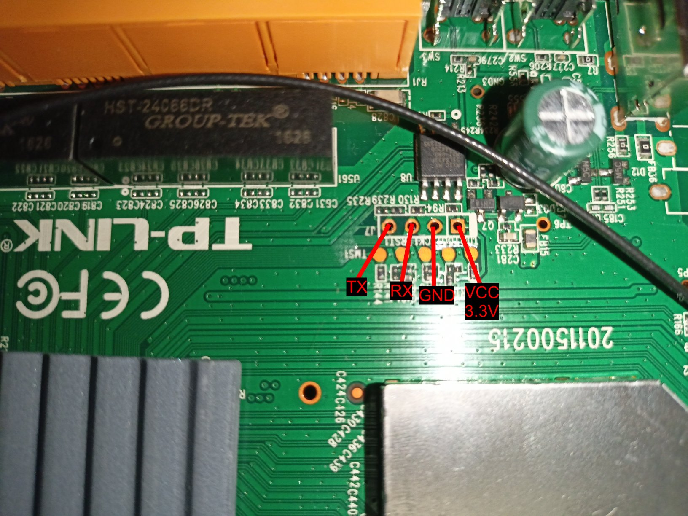

# Archer D20 Research
This repo aims to provide information about the TP-Link Archer D20 Modem Router.
The stock firmware runs a version of OpenWRT with kernel version 2.6

## Getting UART
The UART pins on the board are not clearly labeled. Use this image as reference.



Use the following table to connect to a UART adapter

| Router | UART Adapter |
| ------ | ------------ |
| TX     | RX           |
| RX     | TX           |
| GND    | GND          |
| VCC    | DONT CONNECT |

## UBoot Console
When the router is initially booting, it will tell you to press *any key* to stop autoboot.
However, what you actually need to do is press `t` in order to get to the console.
A successful entry into the console should look like this.
```
ROM VER: 1.1.0
CFG 05

ROM VER: 1.1.0
CFG 05

DDR autotuning Rev 1.0
DDR size from 0xa0000000 - 0xa3ffffff
DDR check ok... start booting...


U-Boot 2010.06-LANTIQ-v-2.2.67 (Jan 26 2016 - 10:15:11)

CLOCK CPU 500M RAM 250M
16 Bit RAM
DRAM:  64 MiB
Using default environment

In:    serial
Out:   serial
Err:   serial
Net:   internal phy using 25Mhz clock
Internal phy firmware version: 0xc434
ar10 Switch8192 KiB MX25L6405D at 0:0 is now current device
MAC: 00-00-5e-00-53-af  


Type "run flash_nfs" to mount root filesystem over NFS

Hit any key to stop autoboot:  0 
AR10 # 
```
## References
[Full Bootlog](https://github.com/bengris32/Archer_D20/blob/master/logs/bootlog-stock.txt)

## OEM Support
[Stock Firmware](https://static.tp-link.com/res/down/soft/Archer_D20_V1_150728.zip)  
[GPL Code](https://static.tp-link.com/resources/gpl/ArcherD20v1_GPL.tar.gz)
